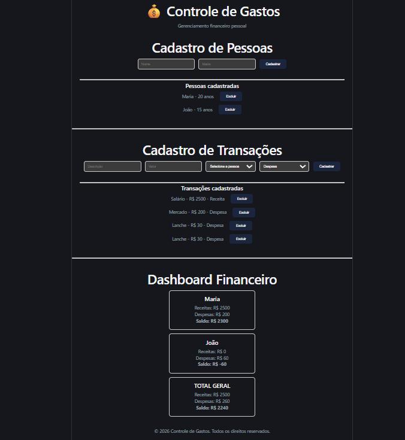
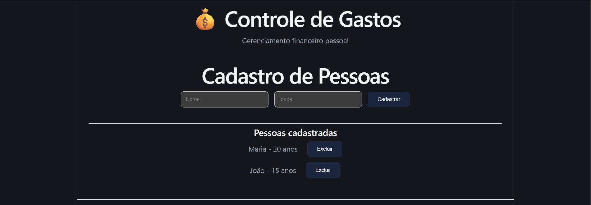
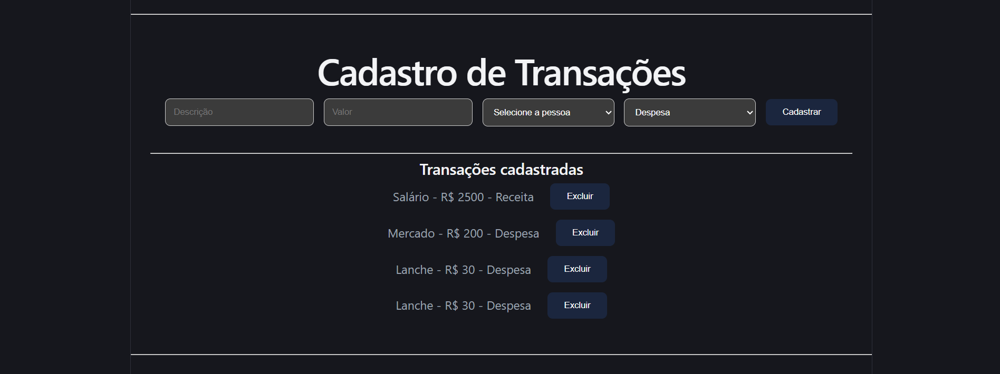
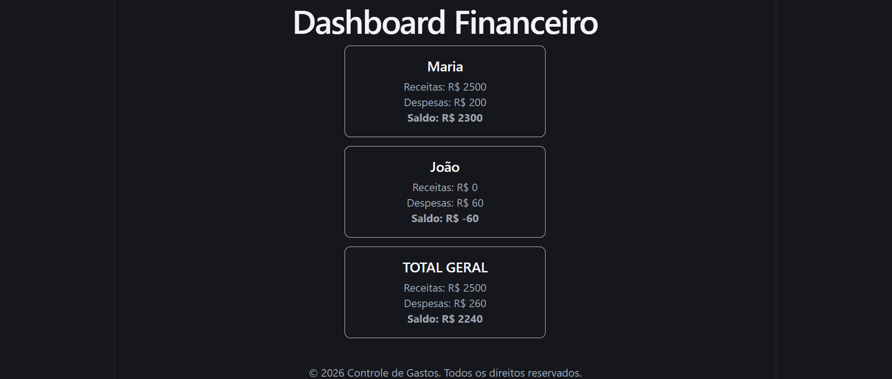

# 💰 Controle de Gastos

Projeto desenvolvido como desafio técnico utilizando **ASP.NET Core** no backend e **React + TypeScript** no frontend.

O sistema permite cadastrar pessoas, registrar receitas e despesas, aplicar regras de negócio e calcular automaticamente os saldos.

---

## 📸 Demonstração

### Tela completa



---

### Cadastro de Pessoa



---

### Cadastro de Transação



---

### Dashboard



---

# ✨ Funcionalidades

- Cadastro de Pessoas
- Cadastro de Receitas e Despesas
- Exclusão em cascata das transações
- Restrição para menores de idade (apenas despesas)
- Cálculo automático do saldo por pessoa
- Cálculo do saldo geral

---

# 🛠 Tecnologias

### Backend

- C#
- ASP.NET Core
- Entity Framework Core
- SQLite

### Frontend

- React
- TypeScript
- Vite
- Axios

---

# 📂 Estrutura do Projeto

```
ControleGastos
│
├── Backend
│
├── Frontend
│
└── README.md
```

---

# 🚀 Como executar

## Backend

```bash
cd Backend
dotnet restore
dotnet run
```

## Frontend

```bash
cd Frontend
npm install
npm run dev
```

---

# 📌 Regras de Negócio

✔ Menores de idade podem cadastrar apenas despesas.

✔ Ao excluir uma pessoa, todas as suas transações são removidas automaticamente.

✔ O sistema calcula o saldo individual e o saldo geral.

---

# 👩‍💻 Desenvolvedora

**Maria de Fátima Ferreira**

- Engenharia de Software
- GitHub: https://github.com/Mafa-xp
- LinkedIn: https://www.linkedin.com/in/maria-de-fatima-ferreira/
